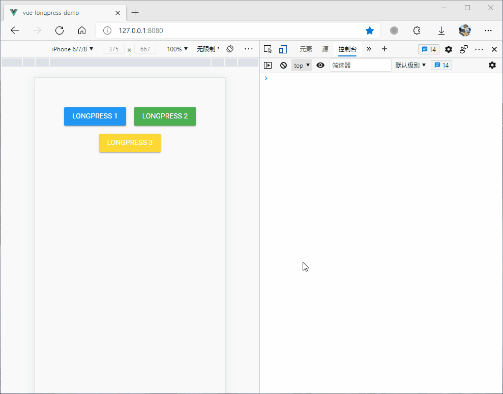

# vue-long-press

> Vue long press directive plugin，一个 Vue 长按事件指令插件，长按时间隔默认`800ms`，可通过对象字面量参数配置

Fork from:https://github.com/huajianduzhuo/vueConfig/tree/master/plugins/LongTap

## Use

**main.js**

```javascript
import LongPress from '@/plugin/LongPress'

Vue.use(LongPress)
```

**App.vue**

```javascript
<mu-container class="button-wrapper">
    <mu-button v-longpress="{handler: longpress,params:{token:'263499118'}}" color="info">LongPress 1</mu-button>
    <mu-button v-longpress="()=>longpress({token:'263499118'})" color="success">LongPress 2</mu-button>
    <mu-button v-longpress="(event,el,vNode)=>longpress2(event,el,vNode,{token:'263499118'})" color="warning">LongPress 3</mu-button>
    
    // 不能用以下方式绑定方法
    // <mu-button v-longpress="longpress({token:'263499118'})" color="success">LongPress 4</mu-button>
</mu-container>
```

```javascript
methods: {
    longpress(data) {
        console.log(data.token)
    },
    longpress2(event,el.vNode,data) {
        console.log(event)
        console.log(el)
        console.log(vNode)
        console.log(data.token)
    }
}
```

## 对象字面量配置参数

使用对象字面量方式绑定长按事件，可以配置一些参数

| 参数    | 类型    | 是否必需 | 默认值 | 说明                                                                |
| :-----: | :-----: | :------: | :----: | :-----------------------------------------------------------------: |
| handler | 函数    | 是       | 无     | 长按事件回调函数                                                    |
| time    | integer | 否       | 800   | 单位：ms，长按间隔时间，必须超过 500ms                              |
| disX    | number  | 否       | 10     | 单位：px，判断手指是否移动了的间隔，若为负数，则允许 X 方向上的移动 |
| disY    | number  | 否       | 10     | 单位：px，判断手指是否移动了的间隔，若为负数，则允许 Y 方向上的移动 |
| params    | any | 否       | 无   | 长按事件回调函数

## 长按回调函数参数（没有配置 params 时）

| 参数  | 类型    | 说明                   |
| :---: | :-----: | :--------------------: |
| event | Event   |                        |
| el    | DOM元素 | 触发长按事件的元素     |
| vNode | vNode   | 触发长按事件的虚拟节点 |

## 长按回调函数参数（配置 params 时）

| 参数  | 类型    | 说明                   |
| :---: | :-----: | :--------------------: |
| params    | any |  对象字面量配置的参数    |

## 长按时元素样式

长按元素时，可以为该元素添加激活时的样式，只需要添加一个全局的样式 `longtap-active` 即可，若有与元素本身的样式重复的，应添加 `!important`。

> 该样式在点击时也会应用。

